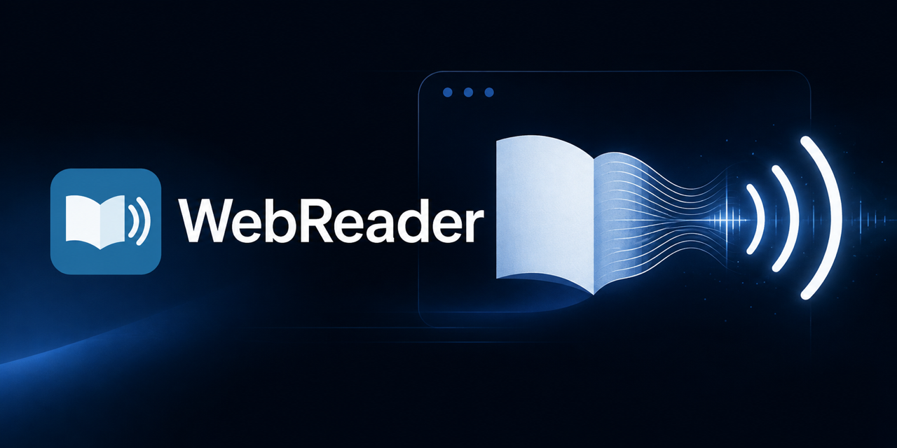

# WebReader



WebReader is a personal Safari Web Extension that reads selected text, text after the cursor, or the main article on the current page through a local TTS Bridge. Browser playback remains temporary and is not written to disk.

The toolbar button injects the familiar floating Restart, Play, Pause, Stop, and Hide controls into the current page. The extension uses Mozilla Readability for article detection, then applies additional filtering for navigation, advertising, forms, comments, related content, links, and other page furniture.

## Current behavior

- Selected text takes priority.
- With no selection, clicking in an article and pressing Play starts near that cursor position.
- With no selection or cursor, Play reads the detected main article.
- Restart begins at the detected article title.
- Hide removes the controls from view until the Safari toolbar button is pressed again.
- The extension requests temporary access to the active tab rather than injecting itself into every page automatically.
- When a site blocks `blob:` media through its Content Security Policy, WebReader falls back to decoded in-memory Web Audio playback.

## Test it in Safari

```bash
cd WebReader
./scripts/build-safari
open safari/WebReader/WebReader.xcodeproj
```

The Xcode project is configured for the same Apple development team used by the other local applications. Select the WebReader scheme, press Run, enable WebReader under Safari Settings > Extensions, and place its button in the Safari toolbar.

## Start the local relay

Point the included loopback relay at an OpenAI-compatible speech endpoint:

```bash
cd WebReader
TTS_BRIDGE_URL=http://127.0.0.1:11440/v1 \
TTS_BRIDGE_VOICE=your-voice-alias \
./scripts/start-helper
```

The relay is implemented with Python's standard library and remains bound to `127.0.0.1:11441`. It accepts Safari Web Extension origins without permitting ordinary external website origins. `TTS_BRIDGE_VOICE` and `TTS_BRIDGE_MODEL` are optional when the bridge supplies its own defaults. The relay keeps synthesized audio in memory and does not write it to disk.

## Enable it in Safari

1. Open `safari/WebReader/WebReader.xcodeproj` in Xcode.
2. Select the WebReader scheme and press Run. The project already specifies the local development team.
3. Run the WebReader app from Xcode.
4. Open Safari Settings, select Extensions, and enable WebReader.
5. Place WebReader in the Safari toolbar if Safari does not add it automatically.
6. Open an HTTP or HTTPS article, press the WebReader toolbar button, and allow access to that website when Safari asks.

Open an external article and verify selection playback first, then cursor playback, and finally whole-article playback. Whole-article mode should omit site navigation, promotional material, reading controls, comments, related content, and the footer.

## Project layout

- `extension/` contains the portable WebExtension source.
- `safari/` contains the generated macOS Safari wrapper and Xcode project.
- `tests/` contains synthetic extraction fixtures and tests.
- `helper/` contains the loopback-only relay between the extension and the TTS Bridge.
- `scripts/start-helper` starts that relay with Safari-extension origin support.
- `scripts/build-safari` compiles the Safari application and extension. Use Xcode to sign and run the local development build.

The generated Xcode project references the files in `extension/`, so normal JavaScript changes do not require regenerating the project.

## Project boundaries

WebReader does not import code, configuration, or assets from another repository. The Safari extension, macOS wrapper, loopback relay, tests, icons, and vendored Readability library all live here.

Runtime speech generation is deliberately kept behind an OpenAI-compatible HTTP endpoint selected with `TTS_BRIDGE_URL`. That endpoint is an external service boundary, not a source or build dependency. WebReader can therefore be used with any compatible local TTS service without checking out one of the maintainer's other projects.

## Maintainer dependencies

NPM is not used by WebReader at runtime and is not required merely to build or run the Safari extension. Mozilla Readability is already vendored under `extension/vendor/`.

NPM is used only when refreshing that pinned third-party library or running the JavaScript extraction tests:

```bash
npm install
npm run sync-vendor
npm test
```

The relay tests use Python's standard library:

```bash
python3 -m unittest discover -s tests -p 'test_*.py'
```
